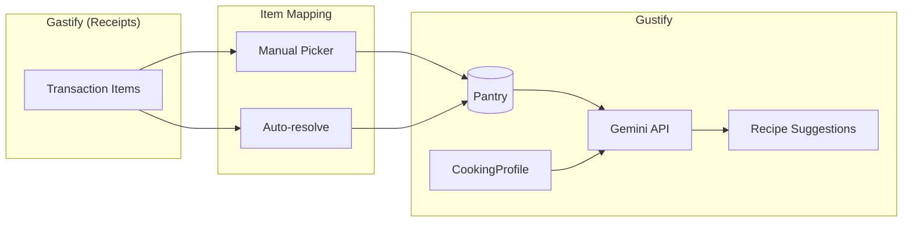
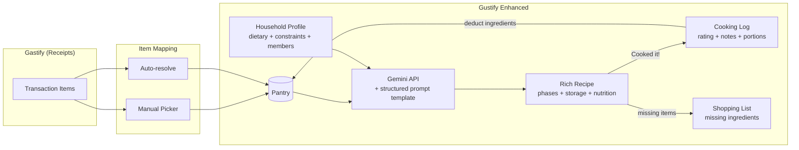
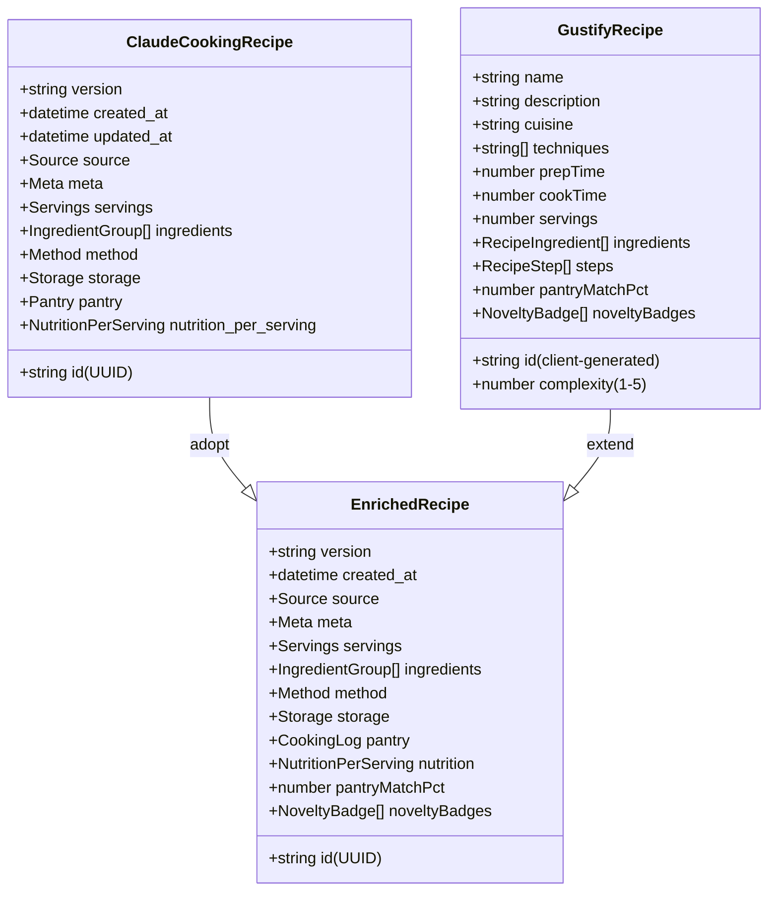
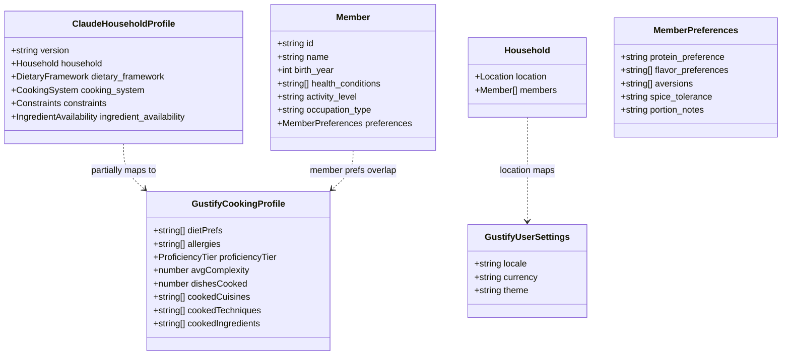
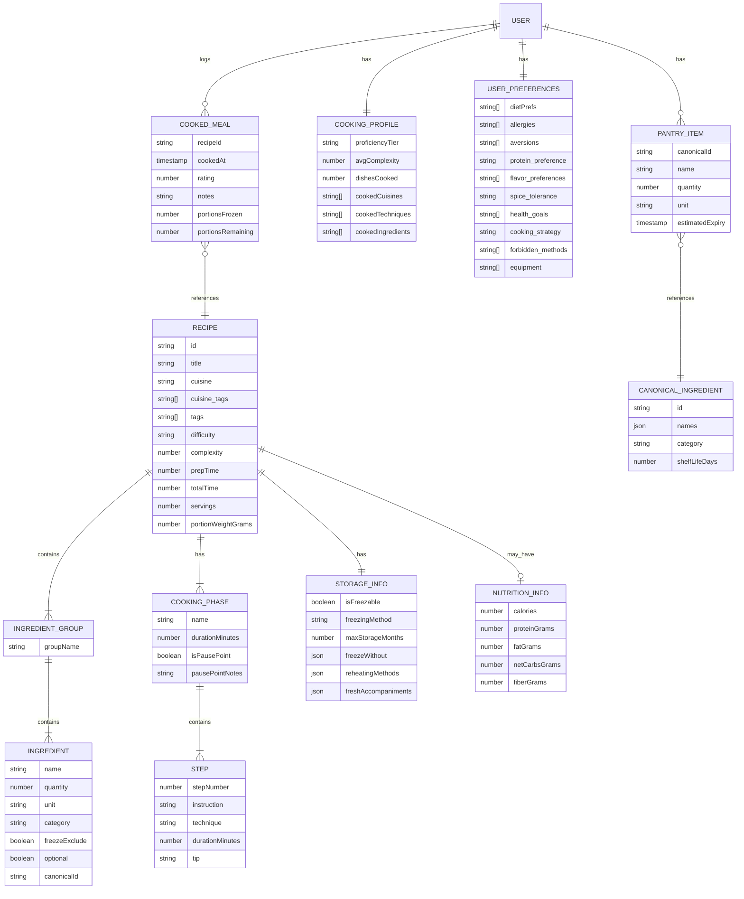
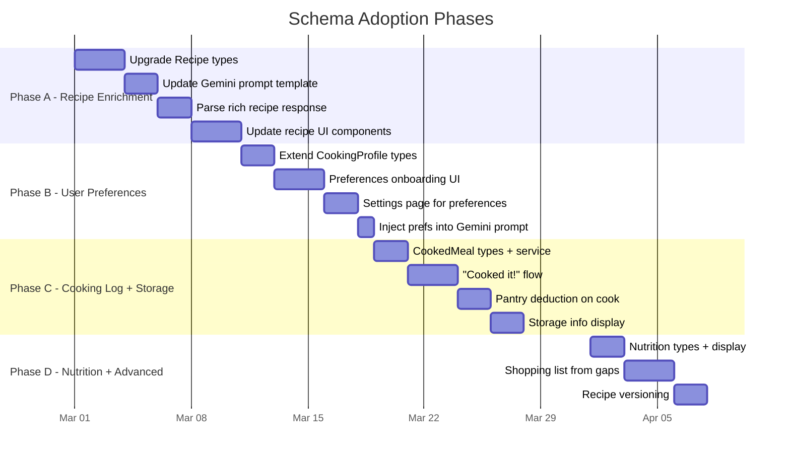
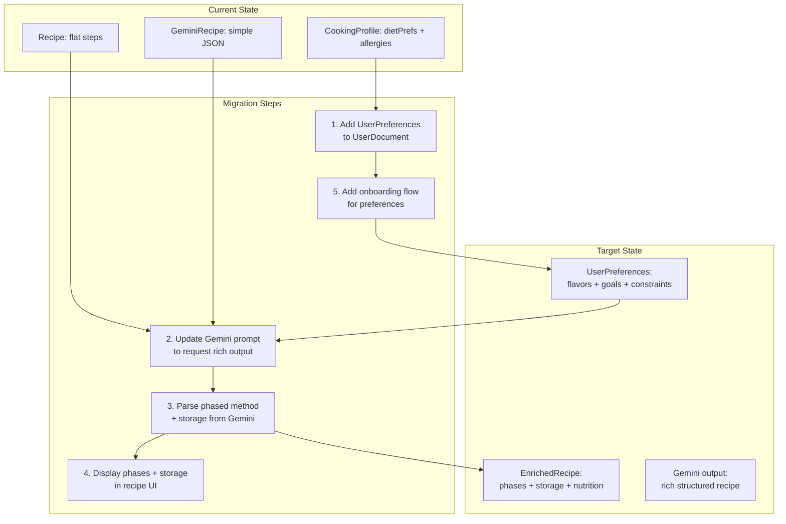

# Claude Cooking Schemas + Gustify Integration Analysis

> **Date:** 2026-02-27
> **Purpose:** Map the Claude Desktop cooking project schemas to Gustify's architecture. Identify what can be adopted, what needs adaptation, and the implementation path.

---

## 1. Executive Summary

The Claude Cooking project defines two rich schemas — **Recipe** and **Household Profile** — designed for a batch-cooking, freeze-and-reheat workflow. Gustify already has simpler versions of both concepts. This document maps every schema field to its Gustify equivalent, identifies gaps, and proposes an adoption strategy.

**Key finding:** ~60% of the schema concepts already exist in Gustify in simpler form. The remaining ~40% would add significant value — particularly **phased cooking methods**, **storage/freezing instructions**, **household member preferences**, and **nutritional data**.

---

## 2. Architecture Overview

### 2.1 Current Gustify Data Flow



### 2.2 Proposed Enhanced Data Flow (With Claude Cooking Schemas)



---

## 3. Schema-to-Gustify Field Mapping

### 3.1 Recipe Schema vs Gustify `Recipe` Interface



#### Field-by-Field Mapping

| Claude Cooking Schema | Gustify Current | Status | Adoption Notes |
|---|---|---|---|
| `id` (UUID) | `id` (client nanoid) | ADAPT | Switch to UUID for persistence |
| `version` | -- | NEW | Add for recipe iteration tracking |
| `created_at` / `updated_at` | -- | NEW | Add timestamps |
| `source.type` | -- | NEW | Track ai_generated / manual / imported |
| `source.ai_model` | -- | NEW | Track which Gemini model generated it |
| `source.generation_prompt` | -- | NEW | Store the prompt used |
| `meta.title` | `name` | EXISTS | Rename to `title` for consistency |
| `meta.title_original` | -- | NEW | Original language name (e.g., "Csirkepaprikás") |
| `meta.description` | `description` | EXISTS | Already present |
| `meta.cuisine` | `cuisine` | EXISTS | Already present |
| `meta.cuisine_tags` | -- | NEW | Hierarchical cuisine tags (european > hungarian) |
| `meta.tags` | -- | NEW | Searchable tags (batch_friendly, comfort_food) |
| `meta.dietary_profile.diets_compatible` | -- | NEW | Which diets this recipe fits |
| `meta.dietary_profile.is_low_sugar` | -- | NEW | Sugar awareness flag |
| `meta.dietary_profile.estimated_carbs` | -- | NEW | Carb estimate per serving |
| `meta.difficulty` | `complexity` (1-5) | ADAPT | Map easy/medium/hard to 1-5 scale |
| `meta.active_time_minutes` | `prepTime` | EXISTS | Same concept |
| `meta.total_time_minutes` | `cookTime` | EXISTS | Rename for clarity |
| `meta.member_suitability` | -- | NEW | Per-member recipe scoring |
| `servings.base_yield` | `servings` | EXISTS | Same concept |
| `servings.portion_weight_grams` | -- | NEW | Weight per portion |
| `ingredients[].group_name` | -- | NEW | Grouped ingredients (Sauce, Protein, etc.) |
| `ingredients[].items[].name` | `ingredients[].name` | EXISTS | Already present |
| `ingredients[].items[].quantity` | `ingredients[].quantity` | EXISTS | Already present |
| `ingredients[].items[].unit` | `ingredients[].unit` | EXISTS | Already present |
| `ingredients[].items[].notes` | -- | NEW | Prep notes, substitutions |
| `ingredients[].items[].optional` | -- | NEW | Optional ingredient flag |
| `ingredients[].items[].category` | -- | NEW | protein/vegetable/spice/etc. |
| `ingredients[].items[].pantry_item` | -- | NEW | Staple flag (salt, oil) |
| `ingredients[].items[].freeze_exclude` | -- | NEW | Do not freeze flag |
| `ingredients[].items[].canonicalId` | `ingredients[].canonicalId` | EXISTS | Pantry cross-reference |
| `ingredients[].items[].inPantry` | `ingredients[].inPantry` | EXISTS | Client-enriched |
| `method.phases[]` | `steps[]` | UPGRADE | Flat steps → phased method |
| `method.phases[].name` | -- | NEW | Phase name ("Build the Sauce") |
| `method.phases[].duration_minutes` | -- | NEW | Phase total time |
| `method.phases[].is_pause_point` | -- | NEW | Batch cooking stop point |
| `method.phases[].steps[].instruction` | `steps[].instruction` | EXISTS | Already present |
| `method.phases[].steps[].technique` | `techniques[]` (recipe-level) | ADAPT | Move to step level |
| `method.phases[].steps[].tip` | -- | NEW | Cooking tips per step |
| `method.timing_coordination` | -- | NEW | Multitasking notes |
| `method.troubleshooting` | -- | NEW | Problem/solution pairs |
| `storage.freezing` | -- | NEW | Freezing instructions |
| `storage.reheating` | -- | NEW | Reheating methods |
| `storage.fresh_accompaniments` | -- | NEW | Suggested sides |
| `pantry.last_cooked` | -- | NEW | For cooking log |
| `pantry.times_cooked` | -- | NEW | For cooking log |
| `pantry.current_frozen_portions` | -- | NEW | Portion tracking |
| `pantry.rating` | -- | NEW | User rating (1-5) |
| `pantry.notes_from_cooking` | -- | NEW | Cooking notes log |
| `nutrition_per_serving` | -- | NEW | Calories, protein, carbs, etc. |

### 3.2 Household Profile Schema vs Gustify User Types



#### Field-by-Field Mapping

| Claude Household Profile | Gustify Current | Status | Adoption Notes |
|---|---|---|---|
| `household.location` | `settings.locale` / `settings.currency` | PARTIAL | Add explicit city/region/country |
| `household.members[]` | Single user (auth) | RETHINK | Gustify is single-user; adapt as preferences |
| `member.health_conditions` | -- | NEW | Valuable for recipe filtering |
| `member.activity_level` | -- | NEW | Nutritional context |
| `member.preferences.protein_preference` | -- | NEW | meat_heavy / balanced / plant_forward |
| `member.preferences.flavor_preferences` | -- | NEW | bold, umami, fresh, herbal, etc. |
| `member.preferences.aversions` | `cookingProfile.allergies` | EXTEND | Allergies + taste aversions |
| `member.preferences.spice_tolerance` | -- | NEW | none / mild / medium / high / extreme |
| `member.preferences.portion_notes` | -- | NEW | Serving size preferences |
| `dietary_framework.primary_diets` | `cookingProfile.dietPrefs` | EXISTS | Same concept, richer enum |
| `dietary_framework.goals` | -- | NEW | weight_loss, blood_sugar_control, etc. |
| `dietary_framework.restrictions.avoid_ingredients` | `cookingProfile.allergies` | EXTEND | More granular (avoid vs allergy) |
| `dietary_framework.restrictions.limit_ingredients` | -- | NEW | Use sparingly with reason |
| `dietary_framework.restrictions.preferred_sweeteners` | -- | NEW | Keto-friendly alternatives |
| `cooking_system.workflow.strategy` | -- | NEW | batch_cook_freeze / meal_prep_fresh / etc. |
| `cooking_system.allowed_methods` | -- | NEW | Filter recipes by available methods |
| `cooking_system.forbidden_methods` | -- | NEW | Never suggest deep frying, etc. |
| `cooking_system.equipment` | -- | NEW | What the user has (oven, vacuum sealer) |
| `cooking_system.freezing_rules` | -- | NEW | Freeze-specific constraints |
| `cooking_system.reheating_methods` | -- | NEW | Available reheating options |
| `constraints.hard[]` | -- | NEW | Non-negotiable rules for recipe gen |
| `constraints.soft[]` | -- | NEW | Preferences with priority |
| `ingredient_availability` | canonicalIngredients collection | PARTIAL | Extend with location-based availability |
| **Gustify-only fields** | | | |
| -- | `cookingProfile.proficiencyTier` | KEEP | Gustify's unique progression system |
| -- | `cookingProfile.avgComplexity` | KEEP | Tier calculation input |
| -- | `cookingProfile.dishesCooked` | KEEP | Progression metric |
| -- | `cookingProfile.cookedCuisines` | KEEP | Exploration tracking |
| -- | `cookingProfile.cookedTechniques` | KEEP | Exploration tracking |
| -- | `cookingProfile.cookedIngredients` | KEEP | Exploration tracking |

---

## 4. Concept Relationship Diagram



---

## 5. Implementation Strategy

### 5.1 Phased Approach



### 5.2 Priority Classification

| Priority | Feature | Source Schema | Effort | Impact |
|----------|---------|---------------|--------|--------|
| **P0** | Phased cooking method | Recipe | Medium | High — core UX improvement |
| **P0** | Storage/freezing instructions | Recipe | Medium | High — batch cooking is core use case |
| **P0** | User flavor/spice preferences | Household | Low | High — better recipe matching |
| **P1** | Ingredient groups + categories | Recipe | Low | Medium — better ingredient display |
| **P1** | Dietary goals (weight loss, etc.) | Household | Low | Medium — filters for Gemini |
| **P1** | Cooking tips per step | Recipe | Low | Medium — UX enrichment |
| **P1** | Recipe rating + cooking notes | Recipe (pantry) | Medium | High — feedback loop |
| **P2** | Nutrition per serving | Recipe | Low | Medium — health-conscious users |
| **P2** | Cuisine tags hierarchy | Recipe | Low | Low — nice for filtering |
| **P2** | Equipment constraints | Household | Low | Low — niche but useful |
| **P2** | Troubleshooting per recipe | Recipe | Low | Low — UX polish |
| **P3** | Member suitability scoring | Household | Medium | Low — multi-user future |
| **P3** | Ingredient availability by location | Household | Medium | Low — Phase 2+ |
| **P3** | Recipe versioning | Recipe | Low | Low — nice for iteration |

---

## 6. Proposed TypeScript Types (Preview)

### 6.1 Enhanced Recipe Type

```typescript
// Merges Claude Cooking schema richness with Gustify's exploration features

interface EnrichedRecipe {
  // Identification
  id: string                          // UUID
  version: string                     // "1.0.0"
  createdAt: Timestamp
  updatedAt: Timestamp

  // Source tracking
  source: {
    type: 'ai_generated' | 'manual' | 'imported' | 'adapted'
    aiModel?: string                  // "gemini-2.5-flash"
    origin?: string                   // "Gemini via Gustify"
  }

  // Metadata
  title: string                       // "Pollo al Pimentón"
  titleOriginal?: string              // "Csirkepaprikás"
  description: string
  cuisine: string
  cuisineTags: string[]               // ["european", "hungarian"]
  tags: string[]                      // ["batch_friendly", "bold_flavor"]

  // Dietary info
  dietaryProfile: {
    dietsCompatible: string[]         // ["dirty_keto", "mediterranean"]
    isLowSugar: boolean
    estimatedCarbsPerServing?: string  // "low (~6g net)"
  }

  // Difficulty & timing
  complexity: number                   // 1-5 (Gustify scale)
  difficulty: 'easy' | 'medium' | 'hard'
  prepTime: number                     // active minutes
  totalTime: number                    // total minutes

  // Servings
  servings: number
  portionWeightGrams?: number

  // Ingredients (grouped)
  ingredientGroups: IngredientGroup[]

  // Method (phased)
  method: {
    phases: CookingPhase[]
    timingCoordination?: string
    troubleshooting?: { problem: string; solution: string }[]
  }

  // Storage & reheating
  storage?: {
    freezing?: {
      isFreezable: boolean
      method: string
      maxStorageMonths: number
      freezeWithout: { ingredient: string; reason: string; addAt: string }[]
    }
    reheating?: {
      method: string
      temperature?: string
      duration?: string
      instructions: string
      postReheatSteps?: string[]
    }[]
    freshAccompaniments?: { item: string; notes?: string }[]
  }

  // Nutrition (optional)
  nutritionPerServing?: {
    calories?: number
    proteinGrams?: number
    fatGrams?: number
    netCarbsGrams?: number
    fiberGrams?: number
    notes?: string
  }

  // Gustify-specific enrichments (client-computed)
  pantryMatchPct: number
  noveltyBadges: NoveltyBadge[]

  // Techniques extracted (for exploration tracking)
  techniques: string[]
}

interface IngredientGroup {
  groupName: string                    // "Sauce Base", "Protein"
  items: RecipeIngredient[]
}

interface RecipeIngredient {
  name: string
  quantity: number
  unit: string
  notes?: string
  optional?: boolean
  category?: 'protein' | 'vegetable' | 'fruit' | 'dairy' | 'fat' | 'spice' | 'condiment' | 'grain' | 'legume' | 'liquid' | 'other'
  freezeExclude?: boolean
  pantryItem?: boolean
  // Gustify enrichments
  canonicalId?: string
  inPantry: boolean
}

interface CookingPhase {
  name: string                         // "Build the Sauce"
  durationMinutes?: number
  isPausePoint: boolean
  pausePointNotes?: string
  steps: RecipeStep[]
}

interface RecipeStep {
  stepNumber: number
  instruction: string
  durationMinutes?: number
  temperature?: string
  technique?: string                   // "braising", "sauteing"
  tip?: string
}
```

### 6.2 Enhanced User Preferences Type

```typescript
// Extends CookingProfile with Household Profile concepts

interface UserPreferences {
  // Existing Gustify fields
  dietPrefs: string[]                  // ["dirty_keto", "mediterranean"]
  allergies: string[]                  // true allergies/intolerances

  // New from Household Profile
  aversions: string[]                  // taste aversions (cucumber, melon)
  healthGoals: string[]                // ["weight_loss", "blood_sugar_control"]
  proteinPreference: 'meat_heavy' | 'balanced' | 'plant_forward' | 'vegetarian' | 'vegan'
  flavorPreferences: string[]          // ["bold", "umami", "spice_forward"]
  spiceTolerance: 'none' | 'mild' | 'medium' | 'high' | 'extreme'
  portionNotes?: string

  // Cooking system
  cookingStrategy?: 'batch_cook_freeze' | 'meal_prep_fresh' | 'cook_daily' | 'hybrid'
  forbiddenMethods?: string[]          // ["deep_frying"]
  equipment?: string[]                 // ["oven", "vacuum_sealer"]

  // Location context
  location?: {
    city: string
    region: string
    country: string
  }
}

// Updated UserDocument
interface UserDocument {
  profile: UserProfile
  cookingProfile: CookingProfile       // exploration tracking (unchanged)
  preferences: UserPreferences         // NEW — dietary + cooking preferences
  settings: UserSettings
}
```

---

## 7. Gemini Prompt Upgrade

The Claude Cooking `api_prompt_template.yaml` provides a battle-tested prompt structure. Key improvements for Gustify's Gemini prompt:

### Current Prompt (simplified)
```
You are a Chilean expert chef. Suggest 3-5 recipes as JSON array.
Pantry: [items]
Prefs: [diets]
Tier: [proficiency]
```

### Proposed Enhanced Prompt
```
You are a recipe generation assistant for Gustify, a cooking companion app.

## USER PROFILE
- Diet: {dietPrefs}
- Allergies: {allergies}
- Aversions: {aversions}
- Flavor preferences: {flavorPreferences}
- Spice tolerance: {spiceTolerance}
- Protein preference: {proteinPreference}
- Health goals: {healthGoals}
- Cooking strategy: {cookingStrategy}
- Forbidden methods: {forbiddenMethods}
- Proficiency: {tier} (complexity {avgComplexity})
- Location: {location}

## PANTRY
{pantryItems}

## OUTPUT FORMAT
Respond with a JSON array of 3-5 recipes. Each recipe MUST include:
- Grouped ingredients with freeze_exclude flags
- Phased cooking method with pause points
- Storage and reheating instructions
- Nutritional estimates
- Dietary compatibility tags

## CONSTRAINTS
{hardConstraints}
{softConstraints}
```

This injects user preferences directly into the prompt context, producing richer recipe output that matches the enhanced schema.

---

## 8. Migration Path for Existing Data



**Key point:** No data migration is needed for existing users. Recipes are ephemeral (generated on-demand, not persisted yet). User profiles just need new optional fields added — the `preferences` sub-document is entirely additive.

---

## 9. What NOT to Adopt

Some Claude Cooking concepts don't fit Gustify's model:

| Concept | Reason to Skip |
|---------|---------------|
| `household.members[]` (multi-member) | Gustify is single-user. Member suitability scoring doesn't apply. Could revisit in Phase 2 for "shared household" feature. |
| `constraints.hard[]` as YAML rules | Gustify should derive constraints from `UserPreferences` fields programmatically, not store a rules engine. |
| `ingredient_availability.chilean_cuts` | Too location-specific. Gustify should handle this via the canonical ingredients dictionary + location context in the prompt. |
| `cooking_system.freezing_rules` (complex) | Adopt the recipe-level `storage.freezing` but skip the system-level rules engine. Let Gemini infer freeze rules per recipe. |
| `recipe.pantry` (app-managed) | Replace with Gustify's `cookedMeals` collection which is already planned. The concept is the same but the data model differs. |

---

## 10. Summary of Recommendations

1. **Upgrade Recipe types** to include phased method, storage instructions, ingredient groups, and nutritional data. This is the highest-impact change.

2. **Add UserPreferences** as a new sub-document alongside `CookingProfile`. Keep exploration tracking (`cookedCuisines`, etc.) in `CookingProfile`; put dietary/flavor/cooking preferences in the new doc.

3. **Enhance the Gemini prompt** using the `api_prompt_template.yaml` pattern. Inject user preferences as structured context. Request rich output matching the enhanced schema.

4. **Build a preferences onboarding flow** — a quick wizard at first login to capture diet, flavor prefs, spice tolerance, and cooking strategy.

5. **Display storage info** in the recipe detail view. Freezing instructions and reheating methods are high-value for the batch-cooking audience.

6. **Use the Claude Cooking schemas as reference documentation**, not as a direct import. Gustify's TypeScript types are the source of truth; the YAML schemas inform what fields to add.